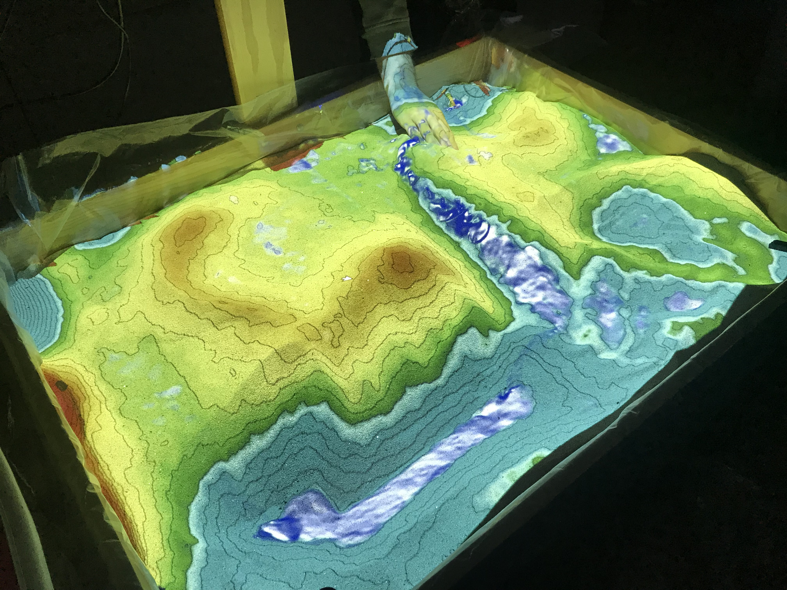

---
---

# La SandBox

La Sandbox est un **bac à sable 2.0** (illustration) qui permet de visualiser de manière ludique le déplacement de l’eau sur du sable qu’on manipule pour créer de nouveaux reliefs.
[UCLA Augmented Reality Sandbox](http://thinkingintermsof.scienceblog.com/2015/08/10/uclas-augmented-reality-sandbox)

Le bac à sable de la Fabrique du Loch s’inspire de la Sandbox originale, la prolonge et l’adapte à la réalité locale.

Augmented Reality Sandbox - How to Build the Sandbox
[https://youtu.be/YLYO0YhY83w?t=271](https://youtu.be/YLYO0YhY83w?t=271)

Inéluctable, la montée des océans est un tel **défi pour l’humanité** qu’il existe déjà un bon nombre d’outils disponibles sur Internet,
simulant différents niveaux de la mer (en mètres avec un curseur).

La Sandox de la Fabrique a ainsi pour objectif, via la réalité augmentée, de rendre visible et concret le phénomène de la **montée des océans** en l’appliquant à un lieu connu de tous. Par exemple, le Golfe du Morbihan, le Port de St-Goustan ou celui de Vannes..

Cet **outil pédagogique**, à la fois simple et complexe, s’adresse à tous les publics.

Il est utilisable par plusieurs types d’intervenants (**enseignants, élus, associations**).

Parce qu’il sera réalisé en **opensource**, le bac à sable pourra être modifié et adapté à d’autres lieux.
Le bac à sable de la FDL et vous….

Pour réaliser ce projet, nous avons besoin de vous (élus, enseignants, associations, institutions, financeurs, etc.) pour….
. accéder gratuitement aux relevés topographiques (mairie)
. sensibiliser une ou plusieurs classes (enseignants) qui s’intéressent au projet

- Le Projet FDVA2 ["La mer à voir"](La_mer_a_voir_Production)
- [Suivi du projet Sandbox](la_page_de_suivi_de_Sandbox)
- [Des liens utiles](Liens_Utiles)
- [La construction du bac à sable](construction)
- [La projection](projection)
- [Les données](donnees)
- [La maquette](maquette)
- [La todo list](todo)
