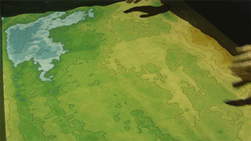

---
---

# La SandBox

La Sandbox est un **bac à sable 2.0** (illustration) qui permet de visualiser de manière ludique le déplacement de l’eau sur du sable qu’on manipule pour créer de nouveaux reliefs.

Le bac à sable de la Fabrique du Loch s’inspire de la Sandbox originale, la prolonge et l’adapte à la réalité locale.

Inéluctable, la montée des océans est un tel **défi pour l’humanité** qu’il existe déjà un bon nombre d’outils disponibles sur Internet,
simulant différents niveaux de la mer (en mètres avec un curseur).

La Sandox de la Fabrique a ainsi pour objectif, via la réalité augmentée, de rendre visible et concret le phénomène de la **montée des océans** en l’appliquant à un lieu connu de tous. Par exemple, le Golfe du Morbihan, le Port de St-Goustan ou celui de Vannes..

Cet **outil pédagogique**, à la fois simple et complexe, s’adresse à tous les publics.

Il est utilisable par plusieurs types d’intervenants (**enseignants, élus, associations**).

Parce qu’il sera réalisé en **opensource**, le bac à sable pourra être modifié et adapté à d’autres lieux.

# Premiers essais de la Sandbox à la Fabrique!

Ce vendredi, les premiers tests de notre sandbox montée ont été réalisés.
Quelques enfants comptent déjà quelques heures de jeu!

# Nous avons besoin de vous!

Pour continuer ce projet, nous avons besoin de vous (élus, enseignants, associations, **institutions**, **financeurs**, etc.) pour
- accéder gratuitement aux relevés topographiques (**mairies**)
- sensibiliser une ou plusieurs classes (**enseignants**) qui s’intéressent au projet

# Le projet Sandbox en détails

- Le Projet FDVA2: ["La mer à voir"](La_mer_a_voir_Production)
- [La construction du bac à sable](construction)
- [La projection](projection)
- [Les données](donnees)
- [La maquette](maquette)
- [Documentation technique](documentation)
- [Mode d'emploi](Affiche_mode_d’emploi)

- [Des liens utiles](Liens_Utiles)

- [La todo list](todo)

